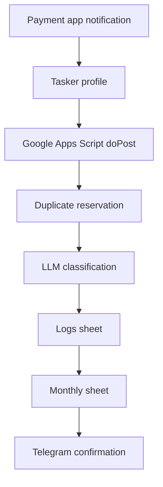

# Android Phone Notification-Based Money Tracker

Track phone payment notifications automatically with Google Apps Script, an LLM, Google Sheets, and Telegram.

When an Android payment app, bank app, wallet, SMS, or email notification arrives, Tasker sends the notification to a Google Apps Script endpoint. The script asks an LLM to classify and extract the transaction, writes the raw and parsed result to Google Sheets, syncs transaction rows into monthly sheets, and sends a Telegram bot confirmation.

## Why this exists

Most day-to-day payments already create phone notifications. This project turns those notifications into accounting records without paid infrastructure.

The free stack is:

- Android Tasker for notification capture and HTTP POST.
- Google Apps Script for the webhook and processing code.
- Google Sheets for storage.
- GitHub Models or another OpenAI-compatible endpoint for LLM parsing.
- Telegram Bot API for record confirmations.

## Current Reliability Features

- Duplicate reservations are written before the LLM call, under an Apps Script lock, so near-simultaneous notifications are less likely to pass the duplicate guard.
- Each log row tracks whether it was synced to a monthly sheet separately from whether Telegram delivery succeeded.
- Telegram sends are retried and failed responses are stored in the Logs sheet.
- Failed Telegram confirmations can be retried by running `retryFailedTelegramNotifications` in Apps Script.

## Setup

Start with [Getting Started](docs/getting-started.md).

Minimum required configuration:

- `SHEET_ID`: the Google Sheet ID used for logs and monthly records.
- `LLM_API_KEY`: your LLM API key.
- `LLM_API_ENDPOINT`: an OpenAI-compatible chat completions endpoint.
- `TELEGRAM_TOKEN`: bot token from BotFather.
- `TELEGRAM_CHAT_ID`: the chat where confirmations should be sent.

## Data Flow

## Dashboard Direction

Google Sheets remains the source of truth. A separate dashboard can import/export the workbook or read published CSV ranges, then provide better charts for spending by month, category, merchant, payment method, and income versus expense.
