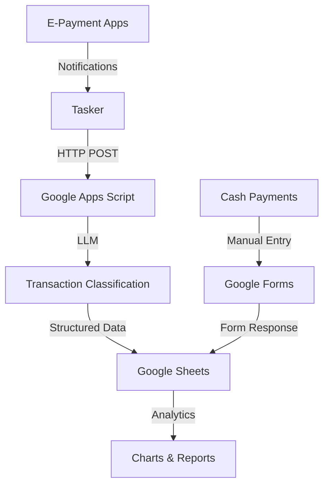

# LLM-Powered Expense Tracker 
# 用 LLM 幫手記賬！

An intelligent expense tracking system that utilizes Android Tasker automation to process transaction notifications, uses LLM for smart classification and data extraction, and visualizes in Google Sheets with tables and charts.

## Key Features
1. Automation 
2. Privacy - You own your data
3. Free*

*It is free if you have already purchased [Tasker](https://play.google.com/store/apps/details?id=net.dinglisch.android.taskerm&hl=en). You can have 7-days free trial for Tasker. The subsequent setup of google app script, google form, google sheet, and LLM from Github model are free.

## System Overview

